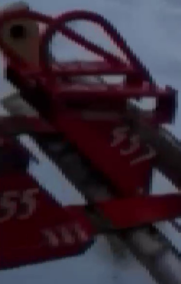
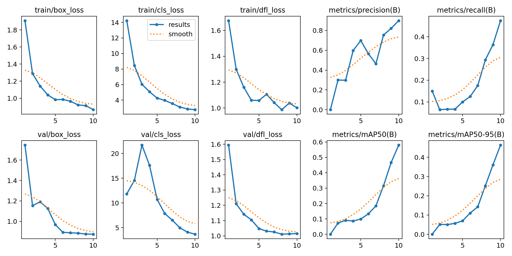
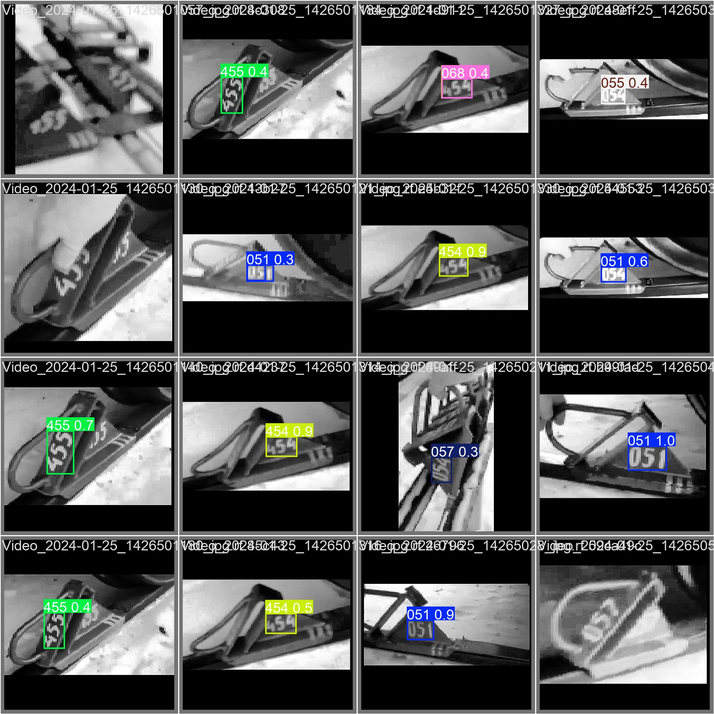

# 0. Описание исходных данных

Исходные данные представляют собой набор изображений "Brake Shoe Numbers" (147 файлов в формате JPG) из папки data/, содержащих номера башмаков — последовательности цифр (0–9), нанесённые белым цветом на красном фоне. Основные особенности данных:

Разнообразие разрешений и пропорций: Разрешения варьируются от 225x530 до 936x428 пикселей, а соотношения сторон — от 0.27:1 до 4.44:1, что требует унификации (например, масштабирования до 640x640 с добавлением отступов).
Качество изображений: Некоторые изображения имеют низкое качество (размытие, низкий контраст), что затрудняет распознавание цифр.
Положение и ориентация цифр: Цифры могут быть расположены под разными углами, что усложняет их сегментацию и распознавание.
Частичная видимость: Примерно 10–20% изображений (15–30 файлов) содержат цифры, которые частично или полностью находятся за пределами кадра либо невидимы из-за размытия или низкого качества.
Шум и фон: Несмотря на контрастный фон (красный с белыми цифрами), шум или тени могут мешать сегментации.


# 1. Распознавание номеров тормозных башмаков с использованием фонтанного преобразования

## Описание модуля FountainRecognizer в скрипте module_foutain_recognizer.py
Модуль реализует метод распознавания на основе сравнения графов скелетизированных изображений цифр. 
Он включает предобработку, сегментацию, построение графов (фонтанное преобразование) и сравнение с эталонными шаблонами.


## Этапы обработки

### 1. `preprocess_image(img)`
**Вход**: Цветное изображение с номером.

**Обработка**:
- Перевод изображения в оттенки серого.
- Применение гауссова размытия для подавления шума.
- Адаптивная бинаризация с инверсией (цифры становятся белыми на чёрном фоне).

**Выход**: Бинарное изображение.

### 2. `segment_digits(binary_img)`
**Цель**: Найти и извлечь отдельные изображения цифр.

**Обработка**:
- Использование `cv2.findContours` для поиска всех внешних контуров.
- Обрезка цифр по ограничивающим прямоугольникам (`cv2.boundingRect`).
- Сортировка контуров по x-координате (слева направо).

**Выход**: Отдельные изображения цифр.

### 3. `extract_graph(digit_img)`
**Цель**: Создать графовое представление цифры.

**Обработка**:
- Масштабирование изображения цифры до 64×64 пикселей.
- Скелетизация с использованием `skimage.morphology.skeletonize`.
- Определение точек ветвления и концов на основе количества соседних пикселей.
- Построение неориентированного графа с помощью `networkx.Graph`:
  - **Вершины**: Точки интереса (точки ветвления и концы).
  - **Рёбра**: Соединяют вершины, если расстояние между ними менее 15 пикселей.

**Выход**: Графовое представление цифры.

### 4. `load_templates(directory)`
**Цель**: Загрузить эталонные шаблоны цифр.

**Обработка**:
- Загрузка шаблонов из папки `templates_numbers3/`.
- Преобразование каждого шаблона в граф с помощью `extract_graph`.
- Сохранение в словарь `self.templates`, где:
  - **Ключ**: Цифра (в виде строки).
  - **Значение**: Соответствующий граф.

**Выход**: Словарь шаблонных графов.

### 5. `compare_graphs(G1, G2)`
**Цель**: Оценить сходство между двумя графами.

**Обработка**:
- Простая эвристика: вычисление разности в количестве узлов и рёбер между графами.
- Меньшая разность указывает на большее сходство.

**Выход**: Оценка сходства.

### 6. `recognize_digit(digit_img)`
**Цель**: Распознать отдельную цифру.

**Обработка**:
- Построение графа для входного изображения цифры.
- Сравнение графа со всеми шаблонными графами с помощью `compare_graphs`.
- Выбор шаблона с наименьшей разностью графа.

**Выход**: Распознанная цифра.

### 7. `recognize_number(img)`
**Цель**: Распознать многоразрядное число на изображении.

**Обработка**:
- Предобработка изображения (`preprocess_image`).
- Сегментация цифр (`segment_digits`).
- Распознавание каждой цифры (`recognize_digit`).
- Объединение распознанных цифр в строку.

**Выход**: Строка, представляющая полное число.

Из исходных изображений вручную были вырезаны цифры с номеров тормозных башмаков.

Каждая цифра сохранялась в формате .png в папку templates_numbers/.

Затем применялся модуль для распознавания номеров в скрипте module_foutain_recogizer.py для данных из папки data

В результате распознавание выполнилось некорректно

Пример распознавания:

```
Video_2024-01-25_14265010.jpg: 000000000000
Video_2024-01-25_1426501006.jpg: 00000000000000000
Video_2024-01-25_1426501034.jpg: 000000000000000000
Video_2024-01-25_1426501048.jpg: 000000000000000000000000000000000000000000000
Video_2024-01-25_1426501057.jpg: 00000000000000000
Video_2024-01-25_142650106.jpg: 00000000000000000000000000000
Video_2024-01-25_1426501066.jpg: 000000000000000000000000000000000000000000
Video_2024-01-25_1426501094.jpg: 00000000000000000000000
```

Затем была выполнена дополнительная предобработка шаблонов цифр в скрипте resave_numbers.py для собранных шаблонов цифр, 
шаблоны пересохранились в директорию templates_numbers1. 
 - Приведение к оттенкам серого
 - Масштабирование до фиксированного размера (64×64)
 - Простая бинаризация методом Отсу

Результат снова оказался неудовлетворительным
```
Video_2024-01-25_14265010.jpg: 000000000000
Video_2024-01-25_1426501006.jpg: 00000000000000000
Video_2024-01-25_1426501034.jpg: 000000000000000000
Video_2024-01-25_1426501048.jpg: 000000000000000000000000000000000000000000000
Video_2024-01-25_1426501057.jpg: 00000000000000000
Video_2024-01-25_142650106.jpg: 00000000000000000000000000000
Video_2024-01-25_1426501066.jpg: 000000000000000000000000000000000000000000
Video_2024-01-25_1426501094.jpg: 00000000000000000000000
Video_2024-01-25_1426501101.jpg: 00000000000000000000000000
```

Затем снова была выполнена дополнительная предобработка шаблонов цифр в скрипте resave_numbers2.py для собранных шаблонов цифр, 
шаблоны пересохранились в директорию templates_numbers2. 
 - Эквализация гистограммы (усиление контраста)
 - Гауссово размытие (для уменьшения шумов)
 - Адаптивная бинаризация
 - Морфологическая фильтрация (cv2.MORPH_CLOSE)
 - Центрирование вырезанной цифры на холсте

Результат так же мало отличался от предыдущего
```
Video_2024-01-25_14265010.jpg: 000000000000
Video_2024-01-25_1426501006.jpg: 00000000000000000
Video_2024-01-25_1426501034.jpg: 000000000000000000
Video_2024-01-25_1426501048.jpg: 000000000000000000000000000000000000000000000
Video_2024-01-25_1426501057.jpg: 00000000000000000
Video_2024-01-25_142650106.jpg: 00000000000000000000000000000
Video_2024-01-25_1426501066.jpg: 000000000000000000000000000000000000000000
Video_2024-01-25_1426501094.jpg: 00000000000000000000000
```


Ещё более строгая обработка в resave_numbers3.py, с сохранением в templates_numbers3:
 - Отсу-бинаризация с автоинверсией фона
 - Центрирование самой крупной цифры по контуру
 - Масштабирование с сохранением пропорций
 - Белый холст, чёткое выравнивание

Результат мало отличается от предыдущих, неудовлетворительный
```
Video_2024-01-25_14265010.jpg: 000000000000
Video_2024-01-25_1426501006.jpg: 00000000000000000
Video_2024-01-25_1426501034.jpg: 000000000000000000
Video_2024-01-25_1426501048.jpg: 000000000000000000000000000000000000000000000
Video_2024-01-25_1426501057.jpg: 00000000000000000
Video_2024-01-25_142650106.jpg: 00000000000000000000000000000
Video_2024-01-25_1426501066.jpg: 000000000000000000000000000000000000000000
Video_2024-01-25_1426501094.jpg: 00000000000000000000000
Video_2024-01-25_1426501101.jpg: 00000000000000000000000000
```

# 2. Разметка датасета с помощью roboflow и Обучение модели YOLOv11

Сначала была предпринята попытка разметить датасет с помощью фреймворка python labelImg, но при запуске 
и нажатии некоторых комбинаций кнопок он постоянно вылетал, скорее всего из-за конфликтов версий с актуальными 
версиями фреймворков

Затем с помощью веб сервиса roboflow часть аннотации для изображений была создана с помощью их AI сервиса, все остальные
изображения были аннотированы вручную.

Перед этим этапом была так же произведена предобработка данных и они были пересозданы с одинаковыми размерами.

Финальный датасет был загружен в формате YOLOv11 в директорию dataset.

Затем на полученном датасете была обучена и сохранена модель YOLOv11, 
и были сохранены различные показатели процесса обучения в директории /run.

```python
# train_model.py
from ultralytics import YOLO

# Load a pretrained YOLOv11 model
model = YOLO("yolo11s.pt")

# Train the model
model.train(
    data="dataset/data.yaml",
    epochs=10,
    imgsz=640,
    batch=16,
    device="cpu",  # Use CPU instead of GPU
    patience=5,
    name="brake_shoe_numbers"
)

# Save the trained model
model.save("models/brake_shoe_numbers.pt")
```

Модель обучается с использованием следующих параметров:

- **Путь к данным**: `dataset/data.yaml`  
  Указывает конфигурационный файл с информацией о датасете (пути к изображениям, аннотациям и классам).
- **Количество эпох**: `10`  
  Модель проходит через тренировочный датасет 10 раз.
- **Размер изображений**: `640`  
  Все изображения масштабируются до 640×640 пикселей.
- **Размер пакета**: `16`  
  За одну итерацию обрабатывается 16 изображений.
- **Устройство**: `cpu`  
  Обучение проводится на процессоре, что замедляет процесс по сравнению с GPU.
- **Терпение (patience)**: `5`  
  Обучение останавливается, если метрика на валидации не улучшается в течение 5 эпох.
- **Имя эксперимента**: `brake_shoe_numbers`  
  Результаты обучения сохраняются в папке с этим именем.

### Оценки точности и функции потерь на каждой эпохе для тренировочных и валидационных данных представлены на следующем рисунке.
****

### Пример распознавания номеров на валидационных данных 
****

### Сравнение двух методов производить бессмысленно так как не удалось добиться точности распознавания выше 0% для первого метода. 